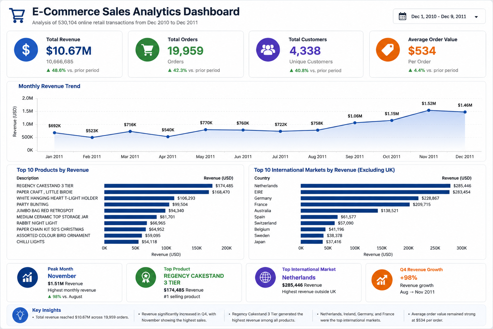

# 🛒 E-Commerce Sales Analytics Dashboard

## 📌 Project Overview

This project analyzes over **530,000 online retail transactions** to identify key sales drivers, product performance, revenue trends, and international market opportunities.

Using **Python, SQL, and Tableau**, I performed data cleaning, exploratory data analysis (EDA), KPI analysis, and dashboard development to transform raw transaction data into actionable business insights.

---

## 🎯 Business Questions

This project aims to answer the following questions:

- How much revenue was generated?
- What are the monthly sales trends?
- Which products generate the most revenue?
- Which international markets contribute the most sales?
- What business insights can be derived from the data?

---

## 📊 Dashboard Preview



---

## 📂 Dataset

**Source:** Online Retail Dataset (UCI / Kaggle)

### Dataset Characteristics

- **530,104** valid transactions
- **19,959** unique orders
- **4,338** customers
- Product-level transaction data
- International sales records

### Key Variables

| Variable | Description |
|----------|-------------|
| InvoiceNo | Transaction ID |
| StockCode | Product Code |
| Description | Product Name |
| Quantity | Quantity Purchased |
| InvoiceDate | Transaction Date |
| UnitPrice | Product Price |
| CustomerID | Customer Identifier |
| Country | Customer Country |

---

## 🧹 Data Cleaning

The original dataset contained cancelled orders, negative quantities, and invalid price values.

The following preprocessing steps were performed:

- Removed cancelled orders
- Removed negative quantity records
- Removed invalid unit price records
- Created a new revenue variable

```python
df = df[~df["InvoiceNo"].astype(str).str.startswith("C")]
df = df[df["Quantity"] > 0]
df = df[df["UnitPrice"] > 0]

df["Revenue"] = df["Quantity"] * df["UnitPrice"]
```

---

## 📈 Key Performance Indicators

| Metric | Value |
|----------|----------|
| Total Revenue | **$10.67M** |
| Total Orders | **19,959** |
| Total Customers | **4,338** |
| Average Order Value (AOV) | **$534** |

---

## 🔍 Analysis Summary

### 1. Revenue Trend Analysis

Monthly revenue was analyzed to identify seasonality and growth patterns.

#### Key Findings

- Revenue increased significantly during Q4.
- November recorded the highest monthly revenue.
- Sales growth accelerated from September through November.

---

### 2. Product Performance Analysis

Products were ranked based on total revenue contribution.

#### Key Findings

- **REGENCY CAKESTAND 3 TIER** generated the highest revenue.
- **PAPER CRAFT, LITTLE BIRDIE** ranked among the highest-performing products.
- A relatively small group of products contributed a significant portion of total sales.

---

### 3. Geographic Analysis

Revenue was analyzed by country to identify the strongest international markets.

#### Key Findings

Top international markets (excluding the United Kingdom):

1. Netherlands
2. EIRE (Ireland)
3. Germany
4. France
5. Australia

These countries represented the strongest international revenue opportunities.

---

## 📊 Tableau Dashboard

The dashboard includes:

- Total Revenue KPI
- Total Orders KPI
- Total Customers KPI
- Average Order Value KPI
- Monthly Revenue Trend
- Top Products by Revenue
- Top Countries by Revenue
- Business Insight Cards

---

## 💡 Key Business Insights

- Generated **$10.67M** in revenue from over **530K transactions**.
- Revenue peaked during the holiday shopping season.
- Top-performing products contributed disproportionately to total sales.
- European countries represented the strongest international revenue opportunities.
- Interactive dashboards can support data-driven decision making for e-commerce businesses.

---

## 🛠️ Tools Used

- Python
- Pandas
- NumPy
- SQL
- Tableau
- Jupyter Notebook
- Git
- GitHub

---

## 📁 Project Structure

```text
ecommerce-analytics-dashboard/
│
├── notebooks/
│   └── ecommerce_analysis.ipynb
│
├── images/
│   └── ecommerce_dashboard.png
│
├── sql/
│   └── ecommerce_analysis.sql
│
└── README.md
```

---

## 👨‍💻 Author

**Namkyeong Kim**

Computer Science Senior, Arkansas State University

**Areas of Interest**
- Data Analytics
- Business Intelligence
- Machine Learning
- Data-Driven Decision Making
